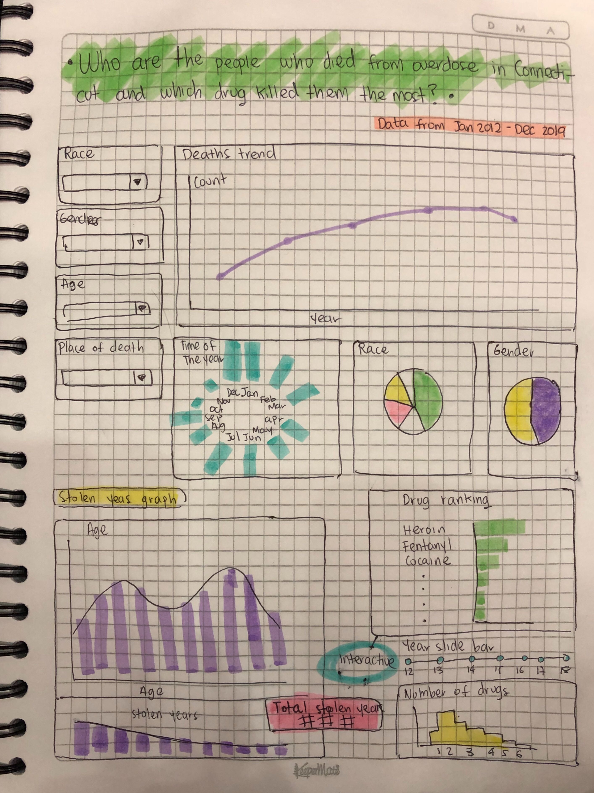

# DSCI_532_Group_113_Overdose

## Description
The landing page of the App is with a title of our research question and the time span of our data. On the left, there are several filters so the users can filter by four variables: race, gender, age and places of death. And on the right, there is a line plot showing the trend of the death amount by years. Users can choose one year from this plot to see the distributions of age, race, gender and death time. For age distribution, users can also see the a plot to show the “stolen years” of dead people, which is the difference between the life expectancy and their dead age. For example, for a 14-year-old death, assuming the life expectancy is 80, the “stolen years” will be 66 years. The total “stolen years” of all people died from drug overdose in the year chosen will be showed as a number on the right. The users can also see the information about drugs people took in this year. One plot shows the ranking of drugs. And the other one is showing the distribution of number of drugs found in the dead’s body. By comparing these plots, the users will be able to describe the dead, and also, likely to see how they died.
 
## Sketch

**Skecth representation**

